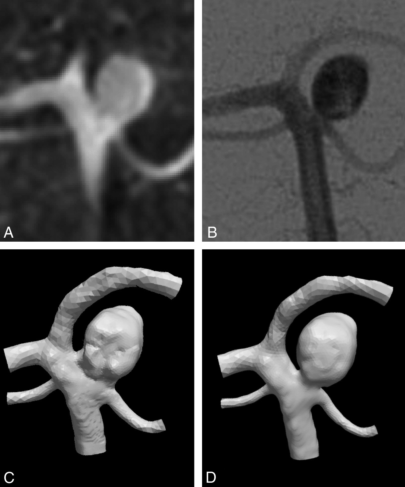
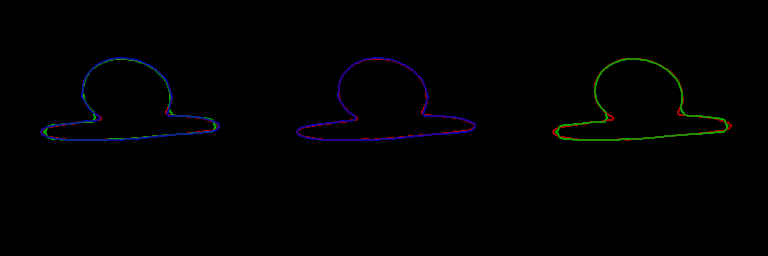
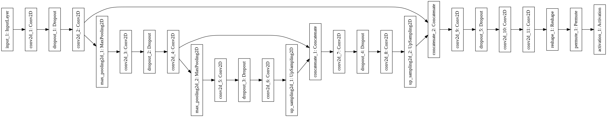

> # Medical-image segmentation of artificial 2D aneurysm models using U-Net
> MIE1516 Final Project 
> 
> Daniel MacDonald
>

## Abstract
The Biomedical Simulation Lab currently uses a watershed segmentation method to produce digitized vascular surface geometries from 3D medical imaging data, but this segmentation method often overestimates a critical geometric value. This critical geometric value may have implications for estimation of an aneurysm’s risk of rupture. As a first pass to better estimation of this parameter, a U-Net will be trained using plausible synthetic 2D data data designed to emulate the setting in which overestimation occurs. The resulting test segmentations are qualitatively compared to watershed methods to assess the performance of the U-Net. Three model architectures are quantitatively compared to assess model performance. 

## Introduction
A cerebral aneurysm is the localized bulging of a weakened artery wall within the brain. Rupture occurs when the stresses exerted on the artery wall exceed the strength of the wall. Blood flow instabilities (hemodynamics) are thought to contribute to the initiation, growth, and rupture of intracranial aneurysms by stimulating degenerative remodelling (weakening) of the artery wall. The forces associated with these unstable flows are difficult to measure non-invasively using current technologies, thus, medical image-based computational fluid dynamics (CFD) has been used to investigate these hemodynamic forces retroactively. 

Using digitized patient-specific vasculature models extracted from clinical 3D angiography images, blood flow is simulated using advanced numerical methods. Segmentation of these 3D images may be subject to varying levels of uncertainty depending on the particular imaging modality and on the geometric properties of the vessels of interest. Imaging modalities of higher resolution may require undesired patient exposure to radiation, and so using imaging modalities of relatively low resolution is desirable. 

Our clinical collaborator currently segments 3D images using a watershed method, which generally results in surfaces that suitably represent the overall vasculature. However, this segmentation method commonly overestimates the diameter of the aneurysm neck, a critical geometric parameter for blood flow dynamics. Figure 1 illustrates the setting in which overestimation occurs. 

  

> Fig 1. An illustration of neck overestimation due to watershed segmentation in an aneurysm.

This overestimation appears to occur to due to the superposition of partial volume effects in small-angle geometries, such as those found between the aneurysm sac and the connecting parent artery. Overestimation of neck geometries may have non-negligible consequences for hemodynamic simulation using CFD by altering location of inflow jet, impingement zone, and low WSS area [1]. 

In special circumstances, overestimation may be verified if multiple imaging modalities were used during treatment. For example, segmentations of a 3DRA image may be compared with high resolution, but two-dimensional, 2DDSA images. Figure 2, reproduced from Schneiders et al [1], illustrates this phenomena. Figure 2A shows an image of an aneurysm obtained by 3DRA; Fig 2B shows the same aneurysm imaged using 2DDSA. The neck appears wider in the lower-resolution 3DRA image. The resulting model generated from the 3DRA image (Fig 2C) maintains this inaccurate wide-neck. Figure 2D shows a modified model intended to more closely resemble the 2DDSA image. 

 
  
> Fig 2. Comparison of the aneurysm neck as imaged by 3DRA (A) and 2D DSA (B). The 3DRA image suggests a wider neck than 2D DSA, which is expressed in the original 3DRA-derived vascular model (C). D, The vascular model after modification. Figure and caption reproduced from Schneiders et al. 

Our lab is not alone in this overestimation. In a 2018 intracranial aneurysm segmentation challenge, participants were given 3DRA images containing an aneurysm; participants were blind to high-resolution 2DDSA images. The resulting segmentations were then compared to 2DDSA clearly showing a thin neck. Of the 26 participating teams, 25 were observed to overestimate the neck diameter [2]. 

Verification of neck estimation is difficult. Firstly, not every imaged aneurysm is imaged using multiple modalities, as in Fig 2. Secondly, not every aneurysm demonstrates such a bottleneck shape; the described setting of overestimation is not present in every aneurysm case, but occurs in a very particular setting. Gathering a dataset to study this particular phenomena may require a very large number of real cases. 

Despite this, we hypothesize that the true neck condition may be extracted from low resolution images.

### Description of real data
Aneurysm diameters are generally in the range 4-10 mm, and imaging resolutions are 0.3mm (3DRA) up to 0.8mm (MRA). These small structures are difficult to clearly acquire with such limited resolution. For example, an aneurysm sac of 5mm imaged with resolution of 0.5mm will only have 10-11 pixels across. The walls and curved surfaces will be only partially resolved. 

Consider the circle on the left of Fig 3 as a 'real life' representation of an artery. If the diameter of this sac is 3 mm, and the resolution of the imaging modality is 0.5 mm, the acquired image (centre) will look pixelated. For a 3mm sac, the sac will be 6 or 7 pixels across. This pixelated image can be upsampled with Gaussian filter antialiasing to appear as a blurred version of the true image, as shown on the right.  

  

> Fig 3. An illustration of the limited resolution when imaging small aneurysmal sacs. Credit to Prof. David Steinman for the illustration. 

Figure 2 shows a 3DRA image, and a 2DDSA image. 4DCTA images are of lower resolution than 3DRA, and are desired for their less-invasiveness acquisition procedures. As such, we desire to segment images of aneurysms with diameter of about 4-25 pixels. This range will roughly simulate the resolution and spatial constraints of real data. 

Intracranial aneurysms come in all shapes and sizes. Raghavan quantified shape and size indices used to discriminate ruptured and unruptured aneurysms [3]. For these 3D shapes, Raghavan et al describe:

- Undulation index  
- Aspect ratio   
- Ellipticity index  
- Non-sphericity index  
- Conicity index  
- Bottleneck factor   

   

> Fig 4. Selected shape indices of intracranial aneurysms. Reproduced from Raghavan et al.

### Description of U-Net
Deep learning has recently made significant advances in semantic image segmentation. The U-Net of Ronneberger et al is a fully convolutional neural network designed for biomedical image segmentation [4]. The U-Net relies on heavy use of data augmentation with elastic deformations in order to make efficient use of small annotated datasets, such as those commonly encountered in the medical setting. Since initial publication, many variations and implementations of the U-Net have emerged.

The U-Net as described by Ronneberger et al (Fig 5) contains a contracting path (left) and an expanding path (right). The contracting path serves as an encoding structure, consisting of 3x3 convolutions followed by a rectified linear unit (ReLU) and 2x2 max pooling layers for downsampling. At each downsampling step, the number of feature channels is doubled. This contracting path allows the network to capture higher-level context. The symmetric expanding path acts as a decoder of the downsampled image. This decoding path consists of upsampling layers followed by ReLU activation and convolution layers. The number of feature channels is halved after each up-convolution. By connecting the contracting path with expansive path, image context is combined with precise localization. This fully convolutional network contains 23 convolutional layers. The authors trained the U-Net with stochastic gradient descent (SGD) using cross entropy as the loss function.

   

> Fig 5. U-net architecture (example for 32x32 pixels in the lowest resolution). Each blue box corresponds to a multi-channel feature map. The number of channels is denoted on top of the box. The x-y-size is provided at the lower left edge of the box. White boxes represent copied feature maps. The arrows denote the different operations. Caption and image reproduced from Ronneberger et al [4]. 

Ronneberger et al claim very good segmentation performance with a very small dataset consisting of only 30 2D images of size 512x512. This performance is achieved through excessive data augmentation. Sub-patches from the input dataset are extracted in order to increase the apparent number of input images. Elastic deformations allow the network to learn invariance to slight anatomical variations, which will be particularly import for segmentation of soft structures such as blood vessels.

### Description of selected metrics for comparing segmentation models
The initial objective of this project is to qualitatively compare the U-Net segmentation of blurry 2D shapes to watershed segmentation, particularly in small angle settings. To do this, segmentation outlines of the true shape will be compared with watershed segmentation and the predicted edge. If the U-Net is able to learn the close contours of small angles better than watershed segmentation, smaller internal angles will be more closely resolved, and the U-Net will be deemed successful.

The images to segment will be grayscale. As such, the interior of the aneurysm and the background of the aneurysm will be relatively unambiguous for segmentation. For this reason, accuracy of segmentation is expected to be high. To evaluate segmentation of this artificial dataset, the following metrics will be used:  

Cross entropy (CE) for binary classification [5]:

   

where y is the target value, either 0 or 1, and p is the model's estimated probability for the class with label y=1. 

Focal loss (FL) modulates cross entropy loss using *focusing* parameter gamma [5]. 
Let:

   

   

Thus, when an example is misclassified, p\_t is small, and the modulating factor is near 1 and the loss is unaffected. As p\_t goes to 1, the modulating factor goes to zero, and the loss for well-classified examples is down-weighted. When gamma = 0, FL is equivalent to CE. The authors found gamma=2 to work best in their experiments. 

Jaccard similarity, otherwise known as intersection-over-union, is used for determining the similarity and of sample sets. 

   

The Dice similarity, otherwise known as F1 score, will be reported for final architectures. This metric is [monotonic in Jaccard similarity](https://brenocon.com/blog/2012/04/f-scores-dice-and-jaccard-set-similarity/). The Dice coefficient is given by:

   

For each final architecture, accuracy, precision, and recall will also be reported.  Given that we are interested in reducing the *overestimation* of the neck (reducing *false positives*), precision is expected to be of great importance.

## Objectives
This project will be the first step in determining an improved method of vessel segmentation for the Biomedical Simulation Lab. As a first step, the scope will be limited to 2D images. Due to time constraints of the project and lack of trustworthy manually segmented images, artificial data will be generated to train the model. The 2D U-Net of Ronneberger et al will be implemented. 

The quality of the model will inevitably be constrained by the quality of the training data. As such, I don't necessarily expect this model to generalize to real data, but the qualitative properties of the predictions will inform future models.

Training using artificial data will have two main benefits: first, it will allow me to test the model's robustness to noise and blur. Second, artificial data will allow me to create extreme geometric cases. Such cases may be plausible but rare in real data. 

The artificial data will have the following characteristics:  

- Data will have limited, realistic resolution  
- Contain small angles and a variety of irregular shapes  

In this controlled environment, I will attempt to address the following research questions:  

- Can U-net segment small angles better than watershed?  
- In a best-case scenario, can the U-Net convert the anti-aliased upsampled image to a "high res" segmentation? 
- Can it denoise an image?   
- Can a deep neural network be trained using physiologically plausible artificial training data be used to generally segment real medical imaging data? 
- Ronneberger et al train the model using 30 training images; with sufficient data augmentation, is 30 images enough? 

Several additional questions arose during the model generation phase:  

- Can a unet trained on style transferred images learn the style of true data with the content of artificial data?   
- Does such a model perform better on real data? 

## Data generation
The results of this project will be presented in these two categories. 

The results of the *data generation phase* are useful for demonstrating the robustness of the model to various changes in data. In this phase, segmentation will be qualitatively compared with watershed segmentations. The goal will be to investigate how the U-Net resolves small angles.

The results of the *architecture testing phase* provide a means for evaluation and help guide the next steps of the project. In this stage, models will be quantitatively compared using various metrics.

All results were generated using the GPU resources (Tesla K80) of Google Colab.

### Artificial data generation and augmentation  
Real data was discussed in the introduction. To generate data, I (roughly) include the shape parameters of Raghavan et al through sinusoidal modulations of randomly generated ellipses. Each artificial aneurysm is generated using one ellipse to represent the sac, and one ellipse to represent the parent artery. Further details of data augmentation will be discussed with context in the results section.

Invariance to rotation and shift is desired. To segment real images, the model will need to some denoising ability. Most importantly, the model will need to learn to "upsample" the blurry, low-resolution acquired images.

We will limit the number of training images to 30 in each case to reflect the limitations of data acquisition and annotation. 

### Data Generation I: Basic artificial images
Artificial data generation provides the benefit of starting from a known ground-truth mask. To generate data, I first generate a reasonable image mask to represent the *true* shape of the aneurysm. I then create a pseudo-acquired blurry image. Based on this "acquired" (blurry) image, I perform a best-effort watershed segmentation to compare with the eventual predicted segmentation. 

In this stage, I generate sacs and parent arteries based on ellipsoids of random aspect ratio and size. Each is roughly registered in the centre of the image. Sacs and parents are independently warped to provide further randomness. 

In this phase, augmentation was performed only using sub-patches of the image, as in the repository on which this project is based. In further stages, additional augmentation will be used to emulate the variety of data observed in real medical images. By randomly extracting patches from the data, some patches are blank. In further stages, this will be corrected. 

To produce the "acquired" image, lightly randomized isometric Gaussian Blur is applied to the initial mask, using a mean of 0 and sigma of about 5 pixels for an image of 256x256. At this time, this blur is only an intuited estimation based on observation of true images. This blur is applied more rigorously in future iterations.

This model, and all models in the Data Generation phase, was trained on overlapping sub-patches of 128x128, using a batch size of 32. The SGD optimizer was used with cross-entropy loss. The model was trained for 20 epochs. Models are generated using Keras with Tensorflow backend. Model details will be discussed in greater detail in the Architecture Testing section. Initially, 19000 sub-images were extracted. An example of sub-patches extracted from an image is shown in the following figure. 

   

> Fig 6. Extracted sub-patches using limited augmentation. Some patches are blank. 

The resulting segmentations are shown in the following figure. From left to right:  
1. "Acquired" image - **input** image to U-Net  
2. Ground truth  
3. Image predicted by U-Net  
4. Watershed of "acquired" image   

 

> Fig 7. For three cases: acquired image, ground truth, image predicted by U-Net, and watershed segmentation of acquired image. 

At this stage we see some improvement in the small angle sections. By comparing the second column (ground truth) with the last column (watershed), the reader may observe the overestimation issue with watershed segmentation of blurred images. Comparing the second column (ground truth) with the third column (U-Net predicted), we see qualitative improvement in these cases.  

### Data Generation II: More augmentation
During this phase, sub-patches were constrained to fall within a particular distance from the centre of the image. This resulted in no blank images in the training set. An example of sub-patches extracted from an image is shown in the following figure. For subsequent data generation phases, this level of zoom, rotation, and flip will be maintained. 

   

> Fig 8. Examples of data augmentation using rotation, shift, horizontal and vertical flipping, and patch extraction. 

This model was trained on overlapping sub-patches of 128x128, using a batch size of 32. The SGD optimizer was used. The model was trained for 20 epochs. 19000 sub-images were extracted. 

The blurred input image as compared with results of this phase for a single neck are shown here:  
 

> Fig 9. Acquired image, ground truth, image predicted by U-Net, and watershed segmentation of acquired image. 

To qualitatively compare the edges of the segmentation more directly, edges are extracted and overlaid. 

- Ground truth is **red**
- Watershed is **green**
- Predicted is **blue**

The leftmost image shows all edges; the middle shows predicted vs truth; the rightmost shows watershed vs truth. We can see that in this case, the predicted outlines is much closer to the ground truth outline in the small angle of the neck compared with the watershed outline. Additionally, the predicted outline better captures the small external angles of the parent artery. 

   

> Fig 10. From left to right: ground truth vs watershed vs prediction; ground truth vs prediction; ground truth vs watershed. 

### Data Generation III: Style augmentation
The biggest problem thus far is that the artificial images don't really look like real images. In an attempt to make the image look more like real images, a tangent was briefly considered... how could we train the model on the noise of real images, but the content of artificial images? Style transfer. 

  

> Fig 11. The content of an artificial mask (left) was combined with the style of a real image (centre) to create a style-transfered image (right).

For a small selection of images, the style of real image data was transferred onto the content of artificial data. Style images were crudely extracted from 3DRA volumes using ParaView, while content images were generated as previously. An existing implementation of [Neural Style Transfer](https://keras.io/examples/neural_style_transfer/) using VGG19 was used to transfer the style. The details of this tangent will not be elaborated in detail. Suffice to say, style transfer produced interesting images, but the generation time for this images was prohibitively expensive. A model trained using 10 of these generated images provided reasonable results, but this exercise did not significantly contribute to the project, but is documented here for future reference.

### Data Generation IV: Generating images for evaluation
As a method for adding noise to the images, style transfer may have been excessively complex. For this project, it will be sufficient to demonstrate reasonable de denoising ability and robustness to slightly random blurring.

For this stage of data generation, blurring is generated more carefully; the ground truth mask is downsampled to 32x32 pixels, then upsampled with Gaussian filter anti-aliasing back to 256x256. This way, we can easily see the pixel-diameter of each sac and artery. Gaussian noise is applied directly to the downsampled image. 

 

  

> Fig 12. Generation of blurred and noised images by downsampling. The centre image shows the "acquired" image. This sac is about 14 pixels in diameter. 

Results of this segmentation are shown here:

  

> Fig 13. Acquired image, ground truth, image predicted by U-Net, and watershed segmentation of acquired image.  

Again, overlays of edges are shown to qualitatively compare the edges of the segmentation.

- Ground truth is **red**
- Watershed is **green**
- Predicted is **blue**

  
  

> Fig 14. From left to right: ground truth vs watershed vs prediction; ground truth vs prediction; ground truth vs watershed. 

Images produced for each of these data generation stages can be found in the folders labelled an_test_*. 

This method of image generation and augmentation will be used to train and test three U-Net architectures, as described in the following section.

## Architecture testing
In this stage, models will be quantitatively compared using the metrics described in the introduction. All results were generated using the GPU resources (Tesla K80) of Google Colab. Models are developed using Keras with Tensorflow backend. Additional results can be found in the folders labelled arch*. The training and testing images are available in the folder labelled DATA.

### Architecture 1: Basic U-Net
For the remaining trials, 30 training images and 20 testing images are generated as described in the previous section. All the following architectures use the same dataset. The 30 training images are augmented to 6000 images using random patch extraction, rotation, and horizontal and vertical flipping. Following a description of the changes in architecture and a few example predictions, the performance of these models will be quantitatively compared. 

To establish a baseline, the architecture as described in Ronneberger's original paper will be tested. This model uses a mini-batch stochastic gradient descent optimizer with batch size of 64. Cross entropy is used as the loss function. Each 3x3 convolution layer is followed by a Dropout layer of 20%, following by a ReLU activation layer. The model architecture is shown in Fig 15. 

   

> Fig 15. Standard model architecture.

The model was trained until no improvement in validation loss occurred for 10 consecutive epochs; this resulted in 71 total epochs with a CPU time of 8h 4min and wall time of 5h 34min on Google Colab with GPU resources

> Fig 16. Acquired image, ground truth, image predicted by U-Net, and watershed segmentation of acquired image. 

Overlaid outlines:

- Ground truth is **red**
- Watershed is **green**
- Predicted is **blue**

> Fig 17. From left to right: ground truth vs watershed vs prediction; ground truth vs prediction; ground truth vs watershed. 

### Architecture 2: U-Net with BatchNormalization
The original U-Net paper was published in 2015; since this time, batch normalization and the Adam optimizer have become more common. This second architecture will implement these two techniques. Dropout layers are replaced with batch normalization and the mini-batch SGD optimizer will be replaced by Adam. 

The model was trained until no improvement in validation loss occurred for 10 consecutive epochs; this resulted in 25 total epochs with a total training time of under 3 hours (exact timing was lost). 

After a single epoch, this model achieved >98.8% validation accuracy. This architecture trained much faster than Architecture 1, stopping early after a total of 25 epochs, while Architecture 1 trained for 71 epochs.

> Fig 18. Acquired image, ground truth, image predicted by U-Net, and watershed segmentation of acquired image.  

Overlaid outlines:

- Ground truth is **red**
- Watershed is **green**
- Predicted is **blue**

> Fig 19. From left to right: ground truth vs watershed vs prediction; ground truth vs prediction; ground truth vs watershed. 

### Architecture 3: U-Net with BatchNormalization and Different Loss function
In the previous architectures, cross entropy was used as the loss function. For the final architecture, I wanted to try a custom loss function. Focal loss was introduced by Lin et al in 2018. This loss function was designed to down-weight the loss assigned to well-classified examples. This property seemed appealing since a large portion of pixels in the training images are unambiguous. This loss simply adds a modulating factor to the cross entropy loss, with a tunable focusing parameter. The Adam optimizer was used with batch normalization, as in Architecture 2. 

Overlaid outlines:

- Ground truth is **red**
- Watershed is **green**
- Predicted is **blue**

> Fig 20. Acquired image, ground truth, image predicted by U-Net, and watershed segmentation of acquired image.

> Fig 21. From left to right: ground truth vs watershed vs prediction; ground truth vs prediction; ground truth vs watershed. 

This model was trained until no improvement in validation loss was observed for 10 iterations, resulting in 25 total iterations.

CPU times: user 2h 56min 12s, sys: 10min 7s, total: 3h 6min 19s
Wall time: 2h 29s

### Summary of results
Three different architectures were tested. As expected, all perform well on this artificial dataset, and all showed qualitative improvement over watershed segmentation. 

Table 1 summarizes the three architectures.

| Architectures | Optimizer |     Regularizer     | Loss function |
|---------------|:---------:|:-------------------:|:-------------:|
| A1            |    SGD    |       Dropout       | Cross entropy |
| A2            |    Adam   | Batch normalization | Cross entropy |
| A3            |    Adam   | Batch normalization |   Focal loss  |

> Table 1. Three variations of U-Net.

Qualitatively, these three architectures performed similarly. Quantitative scoring follows in Table 2. 

| Metric                            | A1              | A2              | A3               |
|-----------------------------------|--------------------|--------------------|--------------------|
| Jaccard similarity score          | 0.9828 | **0.9851**  | 0.9847 |
| F1 score                          | 0.9851 | **0.9871**  | 0.9867 |
| ACCURACY                          | 0.9828 | **0.9851**  | 0.9847 |
| SENSITIVITY                       | 0.9968 | **0.9982**  | 0.9977 |
| SPECIFICITY                       | 0.9643 | **0.9677**  | 0.9674 |
| PRECISION                         | 0.9737 | **0.9762**  | 0.9760 |

> Table 2. Performance of each architecture variation in the U-Net.

Additional overlay figures produced using Architecture 2 are shown here to further assess the quality of segmentation. In all cases, the prediction was qualitatively better than watershed segmentation.

Overlaid outlines:

- Ground truth is **red**
- Watershed is **green**
- Predicted is **blue**

> Fig 22. From left to right: ground truth vs watershed vs prediction; ground truth vs prediction; ground truth vs watershed. 

## Discussion
Overall, these artificial datasets were found to be too easy for the U-Net to learn. Most often, the U-Net achieved >97% accuracy within one or two epochs. On one hand, this is good; real data will inevitably contain more nuance than I can artificially generate, and so the segmentation model has room to grow, so to speak. On the other, this project may appear too simplistic to properly evaluate the merits of the U-Net. 

To address the previously posited research questions:
Given data of limited resolution, the U-Net qualitatively segmented small angle geometries better than the watershed method. The U-net was also able to learn the variety of irregular shapes with invariance to rotation and translation. 

The U-Net eagerly learned segmentations within a small number of iterations. Though each model generalized well to other artificial data, the dataset generation was likely too homogeneous to generalize to real data.  

Each architecture scored very well for these simple images. In all metrics, **Architecture 2** scored marginally best, followed by **Architecture 3**. Considering the total computing time on Google Colab, the combination of Adam + batch normalization demonstrated considerable practical superiority to SGD + dropout.  

In this controlled environment, the U-Net successfully converted the anti-aliased upsampled image to a "high res" segmentation with denoising abilities. For this test scenario, 30 training images was sufficient to train the model, given enough image augmentation. 

This simple test case was useful for establishing the characteristics and limits of the U-Net. The parametric generation of artificial data allowed me to demonstrate the applicability of U-Net for our lab's research problem without manually extracting and segmenting data. 

Among the architectures tested, the combination of Adam optimizer and batch normalization was found to converge faster than SGD and showed better performance. The structure of this architecture was not heavily altered; for this project, the architecture worked extremely well. In future iterations of this project, a deeper U-Net may be investigated, should the need arise.

In further iterations of the project, I would like to test working directly with the downsampled images (32x32) images rather than the upsampled version. As a preliminary exploration in this direction, I tried training the model on upsampled images *without* Gaussian filter anti-aliasing; training using these pixellated-looking images performed well. To truly use the 32x32 images, the architecture would have to be slightly changed, as it is currently set to produce output images of the same resolution as the input. 

## Conclusion
The U-Net demonstrated very good performance segmenting blurry and noisy artificially generated images of limited resolution. 

Segmentation of intracranial aneurysms is a pervasive problem in the intracranial aneurysm CFD community. This project will be pursued further for research purposes. The next step will likely be to create a U-Net for 3D segmentation of artificial data. At this stage, it may be useful to rigorously simulate each medical imaging modality in order to create a realistic training set. 

If training using an artificial dataset cannot be used to segment real image volumes, we will eventually want to manually annotate a selection of training and test cases. Due to the sensitive nature of implementing this work, input from our clinical collaborator will be necessary. 

In a 3D setting, we may want to perform augmentation based heavily on the neck properties. 

This project allowed me to better understand medical image segmentation and provided a solid framework to further pursue.

### Declaration of work completed for course credit
This content of this project will eventually be integrated into my research in the Biomedical Simulation Lab. Work for this project began in mid March 2019. As such, all work was completed for this course.  

This project was heavily based on the repo [Retina blood vessel segmentation with a convolution neural network (U-net)](https://github.com/orobix/retina-unet) by Orobix [6]. Data loading, preprocessing, and basic model architecture was adopted from this repo. Data generation is original work. Data post processing and comparison techniques are a mixture of adopted work and original work. Variations to the network were informed by discussions in class. A number of of organizational practices were learned by using this repo. 

## References
[1] J.J. Schneiders, H.A. Marquering, L. Antiga, R. van den Berg, E. VanBavel, C. B. Majoie, “Intracranial Aneurysm Neck Size Overestimation with 3D Rotational Angiography: The Impact on Intra-Aneurysmal Hemodynamics Simulated with Computational Fluid Dynamics”. American Journal of Neuroradiology. 2013.

[2] P. Berg, S. VoB, S. Saafeld et al, “Multiple Aneurysms AnaTomy CHallenge 2018 ( MATCH ): Phase I : Segmentation,” Cardiovascular Engineering and Technology vol. 9, no. 4, pp. 565–581, 2018.

[3] M.L. Raghavan, B. Ma, R.E. Harbaugh, “Quantified aneurysm shape and rupture risk,” Journal of Neurosurgery, vol. 102, pp. 355–362, 2005.

[4] O. Ronneberger, P. Fischer, and T. Brox, “U-Net: Convolutional Networks for Biomedical Image Segmentation,” 2015. 

[5] T. Lin, P. Goyal, R. Girshick, K. He, P. Dollar, “Focal Loss for Dense Object Detection,” 2018.

[6] D. Cortinovis, Orobix Srl, "Retina blood vessel segmentation with a convolution neural network (U-net)". 2016. 

## Appendix 
### Results
An example of the 20 tested images and results generated using Architecture 3 are shown below. Overlaid outlines follow. Qualitatively, the generated results for each of the architectures look quite similar, showing only small variations. Further results may be observed in the Results folder.

From left to right: input image, ground truth image, predicted image, watershed.

#### Architecture 3: 

Overlaid outlines:

- Ground truth is **red**
- Watershed is **green**
- Predicted is **blue**

